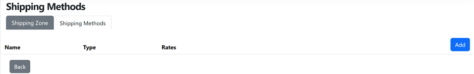
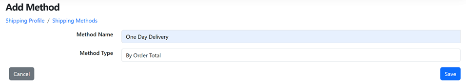

# Creating an online store using DuxCommerce

## Install DuxCommerce

DuxCommerce is implemented as a few Orchard Core modules. Installing DuxCommerce is not different from setting up a Orchard Core website.

1. Clone DuxCommerce [soure code](https://github.com/DuxCommerce/DuxCommerce.Source).

2. Open `DuxCommerce.Source.sln` in Visual Studio and build the solution.

3. Set `DuxCommerce.Web.csproj` as starup project and start it.

4. Fill in the setup form as usual and submit it.

5. Log in using the user account you created in the previous step.

6. In the Admin section, navigate to *Configuration > Features*, enable the following DuxCommerce modules:
   * `DuxCommerce.Storefront`
   * `DuxCommerce.Payments.Offline`
   * `DuxCommerce.Payments.PayPal`
   * `DuxCommerce.Payments.Stripe`

7. Check the logs under `src\DuxCommerce.Web\App_Data\logs` to ensure there are no errors.

8. After a successful installation, a `Commerce` menu will appear in the Admin section.

   

## Manage catalog

Under `Commerce > Catalog`, you can manage categories, products, inventories and shared product options such as size and color.

### Create a category

1. Navigate to *Commerce > Catalog > Categories* and click the *Create* button.

2. Fill in the category details and click *Publish* button.

### Create a product

1. Navigate to *Commerce > Catalog > Products* and click the *Create* button.

2. Enter product name and prices.

3. Select the category created in the previous section.

4. Click the *Publish* button.

## Enable payment methods

DuxCommerce supports PayPal, Stripe and five offline payment methods out of the box. You can enable and configure different paymethods for different countries.

1. Navigate to *Commerce > Settings > Payments* and click the *Enable* button to enable a payment method.

   

2. Click the *Configure* button to configure the selected method.

   

3. Enter payment instructions, choose the countries where the selected method will be available and click the *Save* button

   

## Set up shipping methods

DuxCommerce supports shipping fee calculation based on weight, quantity and order total. You can enable and configure different shipping methods for different countries and regions.

### Update shpping origin

1. Navigate to *Commerce > Settings > Shipping*.
 
2. On the *Shipping Origin* page, click the *Edit* button.

3. Update the shipping origin address and click the *Save* button.

### Define shipping zone

1. On the *Shipping Profile* page, click the *Add Zone* button.

2. On the *Create Zone* page, enter zone name and choose applicable countries and states.

3. Click the *Save* button.

### Create shipping method

1. On the *Shipping Origin* page, selected the created shipping zone by clicking the *Edit* button.

   

2. On the *Edit Zone* page, click the *Shipping Methods* tab.

   

3. On the *Shipping Methods* page, click the *Add* button.

   

4. On the *Add Methods* page, enter method name, choose method type and click the *Save* button.

   

5. On the *Shipping Methods* page, click the *Edit* button.

   

6. On the *Edit Method* page, click the *Add* button.

   

7. On the *Add Rate* page, enter rate detais and click the *Save* button.

   

8. Add more rates until you cover all the ranges.

   

## Configure taxes

DuxCommerce supports tax codes like Tobacco and Alcohol, and three types of tax zones:
* Tax zones based on countries
* Tax zones based on states or provinces
* Tax zones based on postal codes

### Add tax codes

1. Navigate to *Commerce > Settings > Taxes > Tax Codes*.

2. On the *Tax Codes* page, click the *Add* button.

3. On the *Add Code" popup, enter tax code and click *Save* button.

### Define tax zones

1. Navigate to *Commerce > Settings > Taxes > Tax Zones*.

2. On the *Tax Zones* page, click the *Add Zone* button.

3. On the *Create Zone* page, enter zone name, select the first zone type, choose a country and click *Save* button.

   

### Add tax rates

1. Navigate to *Commerce > Settings > Taxes > Tax Zones*.

2. On the *Tax Zones* page, click the *Edit* button.

   

3. On the *Edit Zone* page, click on *Tax Rates* tab and then the *Add Rate* button.

   

3. On the *Add Rate* page, enter rate for each tax code and click the *Save* button.

   